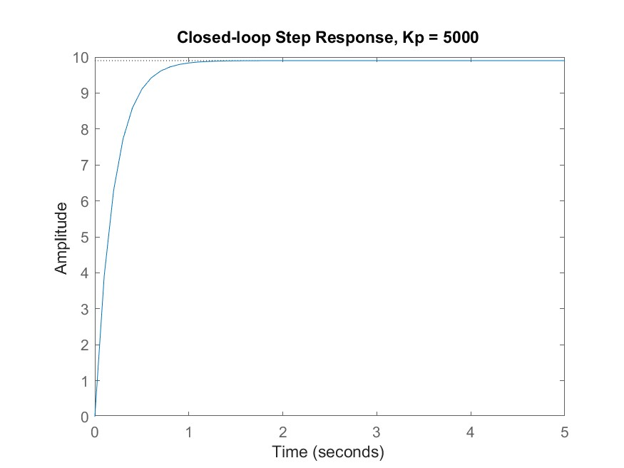
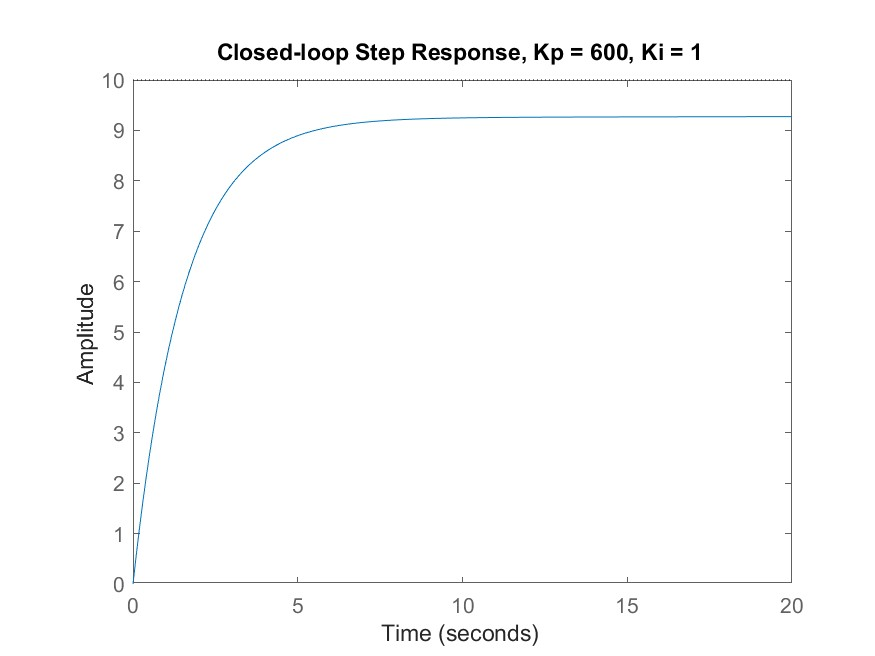

# Open-loop step response
Q1: `1-open.jpg`
> 

Q2(a): Steady state speed $= 10$ m/s

Q2(b): Rise time $= 43.9$ s
> from MATLAB

Q3: False

Q4: `2-open-pzmap.jpg`
> 

Q5: $s = -b/m$
> $ms + b = 0$

Q6: True

# Closed-loop P control
## $K_p = 100$
Q7: `3-closed-step-P-100.jpg`
> 

Q8: $s = -0.15$
> $s = -(b + K_p)/m$

Q9: $τ = 6.7$ s
> $m/(b + K_p)$

Q10: True

Q11: $E_{ss} = 3.3$
> $rb/(b + K_p)$

Q12: False

Q13: False

## $K_p = 5000$
Q14: `4-closed-step-P-5000.jpg`
> 

Q15: $s = -5.05$
> $s = -(b + K_p)/m$

Q16: $τ = 0.198$ s
> $m/(b + K_p)$

Q17: Yes

Q18: $E_{ss} ≅ 0$
> r*b/(b + K_p) ≅ 0 since K_p is very large

Q19: Yes

Q20: Yes

Q21: `5-closed-step-P-5000-u.jpg`
> 

Q22: $u = 50000$ N

## Reduce $K_p$ to satisfy $u = 500$ N
Q23: $K_p = 50$

Q24: `6-closed-step-P-50-u.jpg`
> 

Q25: `7-closed-step-P-50.jpg`
> 

Q26: $E_{ss} = 5$
> $rb/(b + K_p) = 10/2$

# Closed-loop PI control
## $K_p = 600, K_i = 1$
Q27: `8-closed-step-PI-1.jpg`
> 

Q28: $s = -0.6485, -0.0015$
> $ms^2 + (b + K_p)s + K_i = 0$

Q29: $E_{ss} = 1$
> realistically since it takes very long to reach 10

Q30: $τ = 1.8$ s?
> i calculated $2(m + K_d)/(b + K_p)$

## $K_p = 800, K_i = 40$
Q31: `9-closed-step-PI-40.jpg`
> 

Q32: $s = -0.8, -0.05$
> $ms^2 + (b + K_p)s + K_i = 0$

Q33: $E_{ss} = 0$

Q34: $τ = 1.8$ s? 

# Closed-loop PID control
## $K_p = 1, K_i = 1, K_d = 1$
Q35: `10-closed-step-PID-1.jpg`
> 

Q36: $E_{ss} = 0$

Q37: $τ = 58$ s?
> if you take as 63% value, else $2(m + K_d)/(b + K_p) = 39$

# Simulink
Q38(a): `ccmodel.slx`

Q38(b): `ccpi.slx`

Q38(c): `ccpitf.slx`

Q39: `11-ccpi.jpg`
> 