# Open-loop step response

Q1: `1-open.jpg`

> [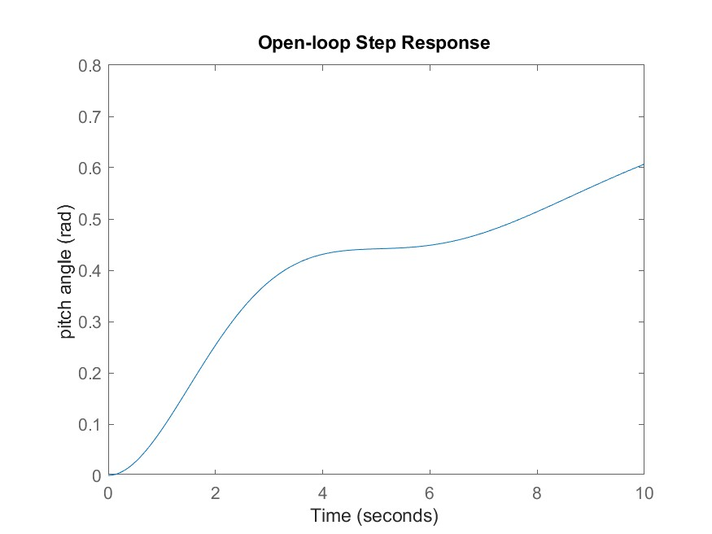](plots/1-open.jpg)

Q2: Infinite

Q4: Unstable

# Closed-loop step response

Q5: `2-closed.jpg`

> [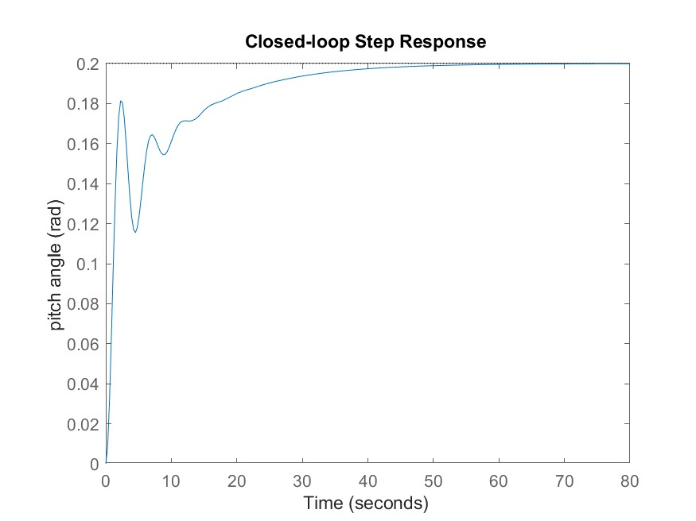](plots/2-closed.jpg)

Q6: $P_{ss} = 0.2$ rad

Q7: Rise time $= 1.79$ s

Q8: Settling time $= 35.1$ s

Q9: $s = -0.0881, -0.3255 ± 1.3816i$

Q10: $0.2000 - 0.1121e^{-0.3255t}(\cos(1.3816t) + 0.2856\sin(1.3816t)) - 0.0879e^{-0.0881t}$

Q11: `3-closed-yt.jpg`

> [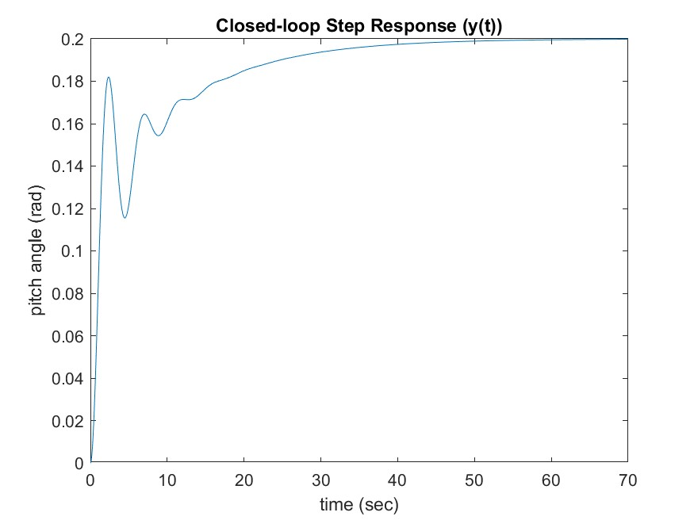](plots/3-closed-yt.jpg)

Q12: `4-closed-step-P.jpg`

> [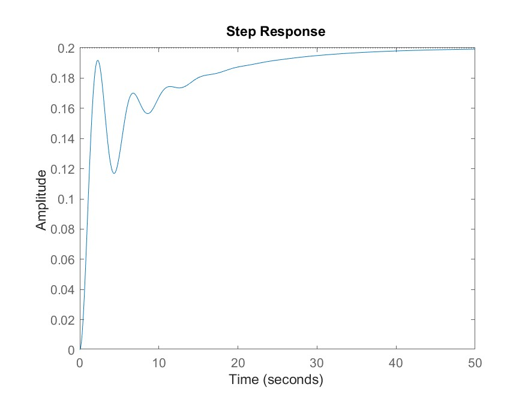](plots/4-closed-step-P.jpg)

Q13: Settling time $= 32.6$ s

Q14: `5-closed-step-PI.jpg`

> [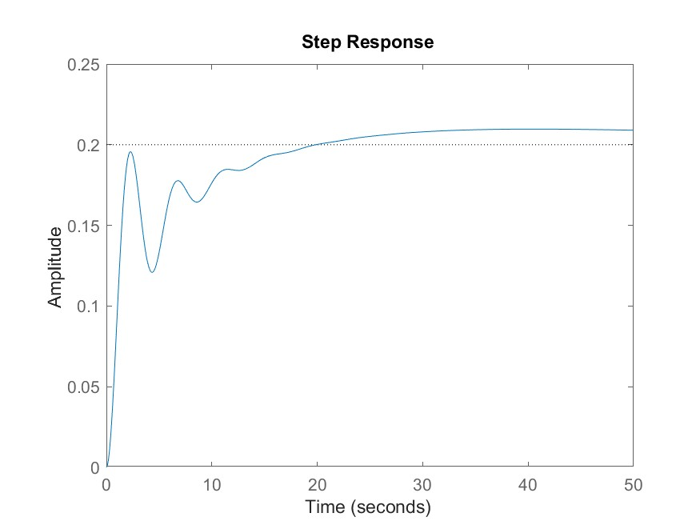](plots/5-closed-step-PI.jpg)

Q15: Overshoot $= 4.83\%$

Q16: `6-closed-step-PID.jpg`

> [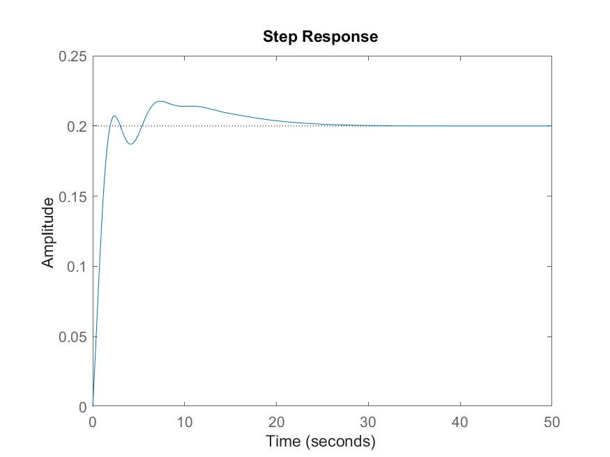](plots/6-closed-step-PID.jpg)

Q17: Overshoot $= 8.82\%$

Q18: Settling time $= 19.6$ s

Q19: Rise time $= 1.34$ s

Q20: `7-root-locus.png`

> [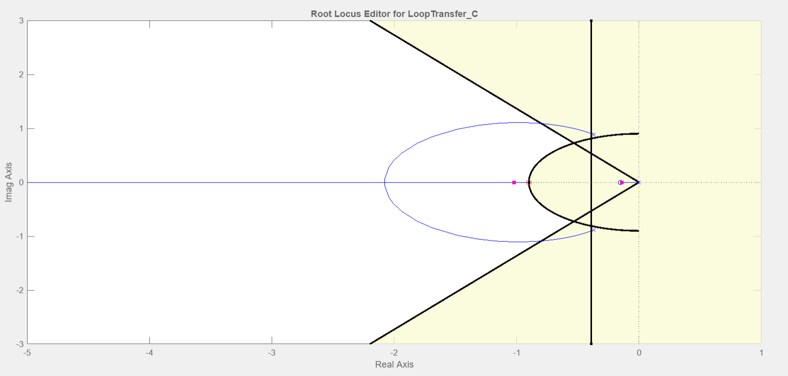](plots/7-root-locus.png)

Q21: `8-closed-step-lead.jpg`

> [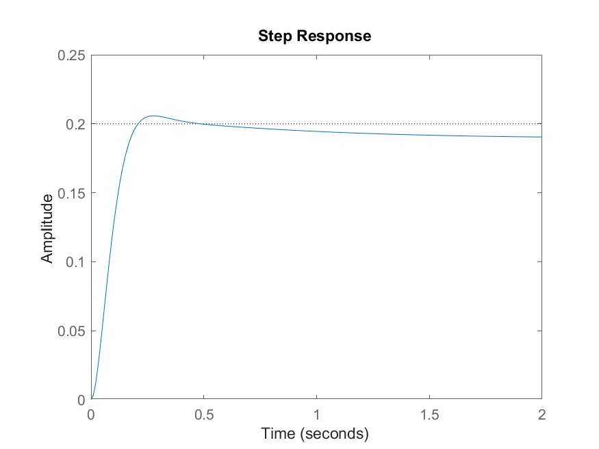](plots/8-closed-step-lead.jpg)

Q22: Rise time $= 0.13$ s

Q23: Overshoot $= 2.86\%$

Q24: `9-bode.jpg`

> [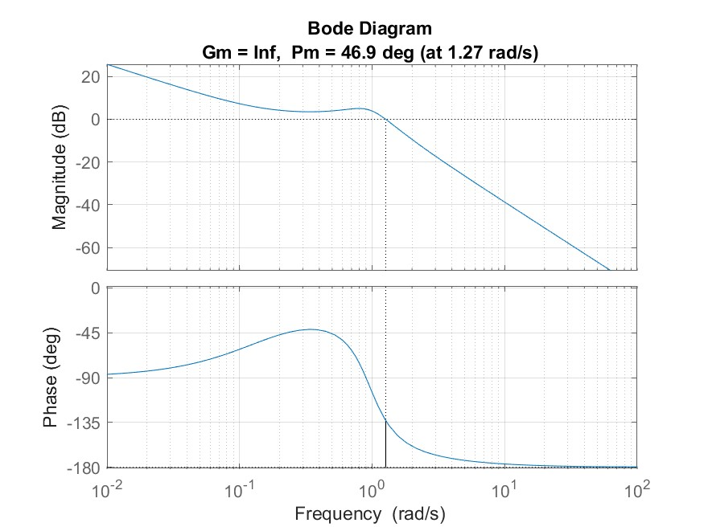](plots/9-bode.jpg)

Q25: Gain margin $=$ Infinite dB

Q26: Phase margin $= 46.9$ deg

Q27: Bandwidth =

Q28: `10-bode-K-10.jpg`

> [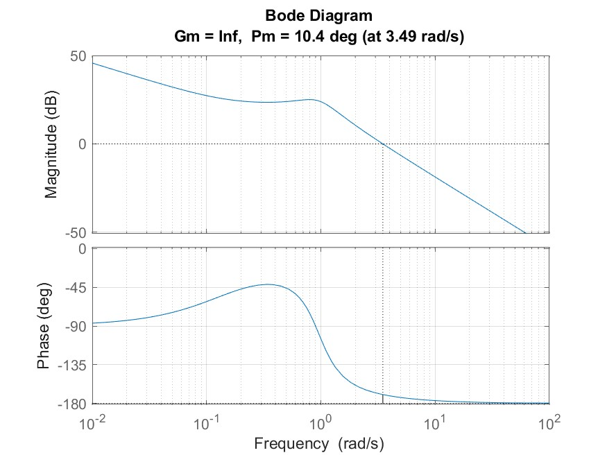](plots/10-bode-K-10.jpg)

Q29: `11-closed-step-K-10`

> [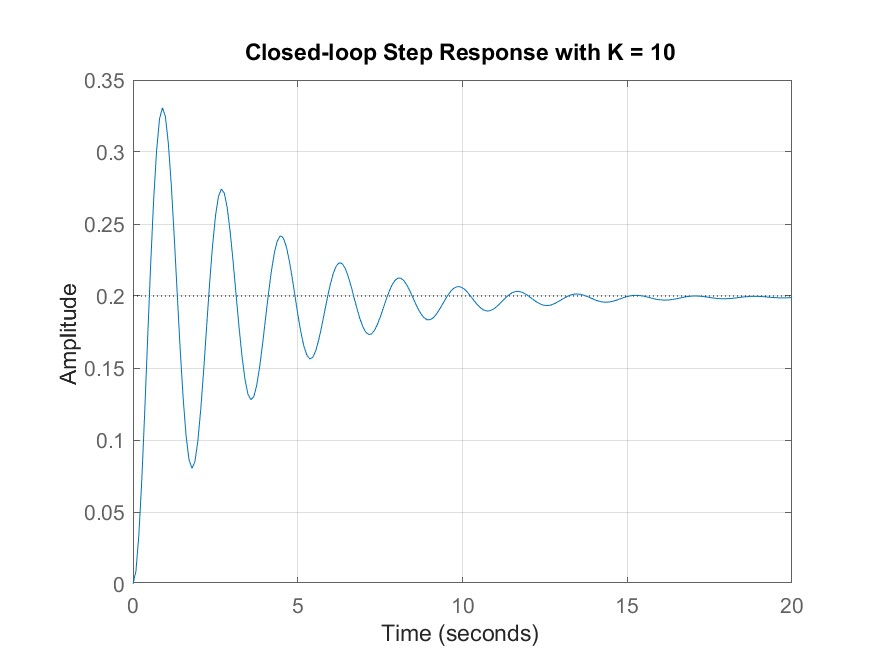](plots/11-closed-step-K-10.jpg)

Q30: Both correct

> PM increased
> Bandwidth increased

Q31: `12-bode-lead.jpg`

> [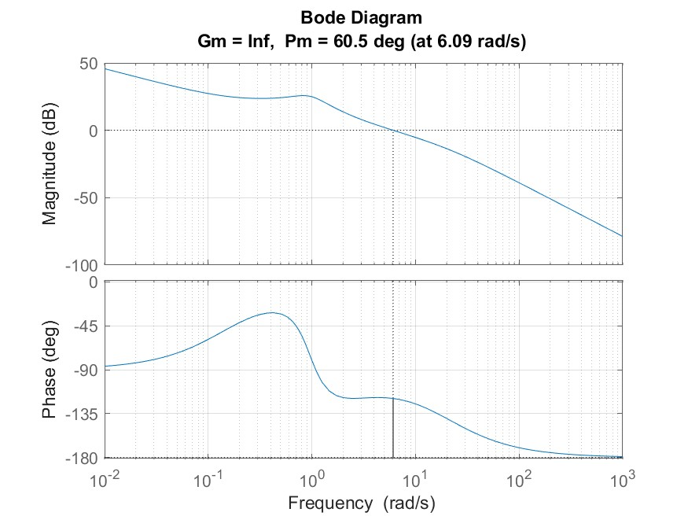](plots/12-bode-lead.jpg)

Q32: `13-closed-step-lead.jpg`

> [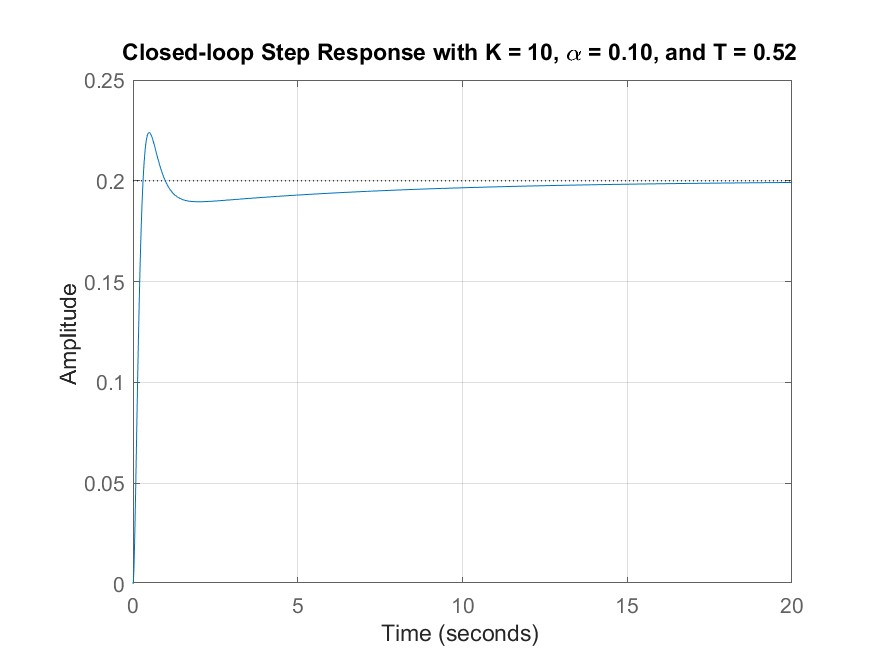](plots/13-closed-step-lead.jpg)

Q33: `14-closed-step-lead-modified.jpg`

> 

Q34: Overshoot $= 6.8478\%$
