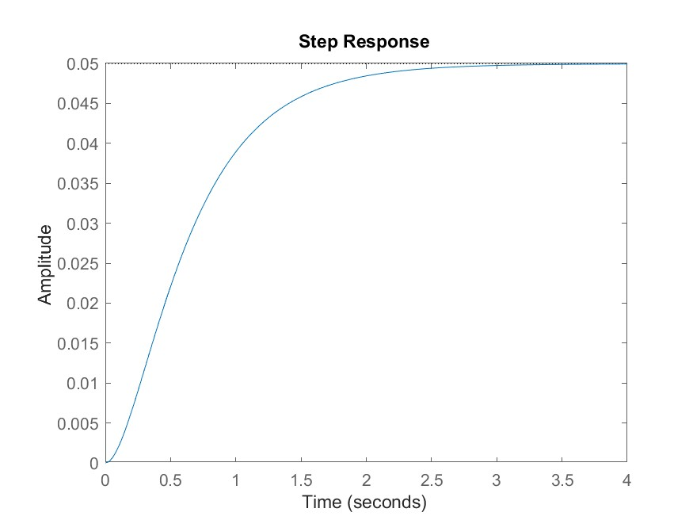
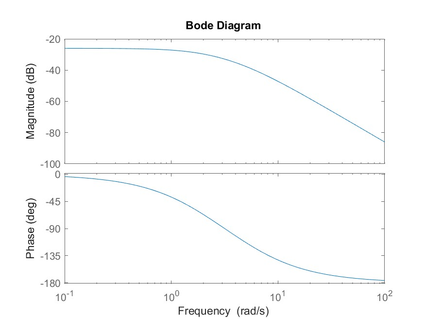
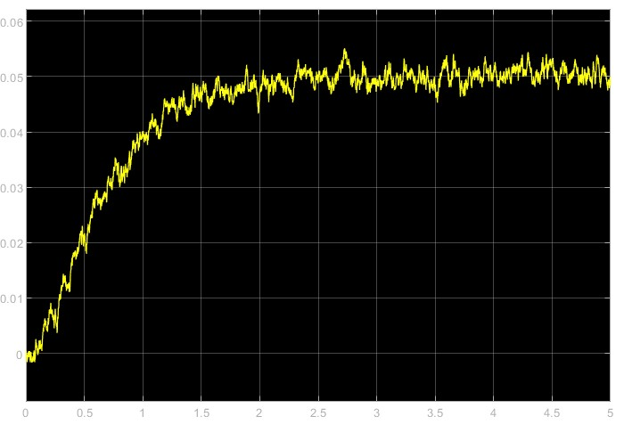
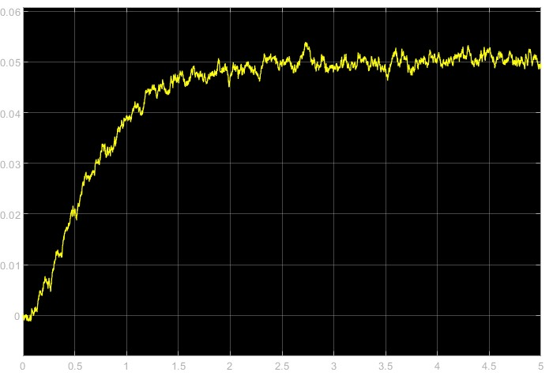
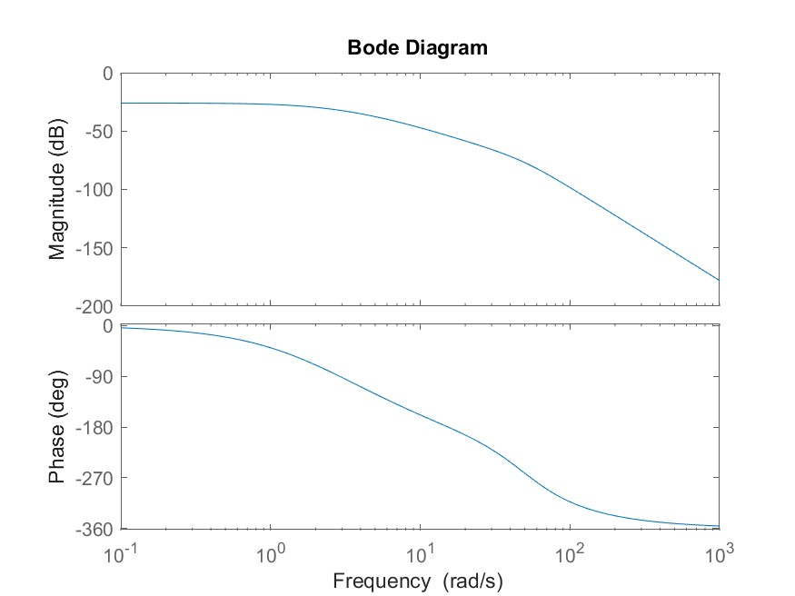
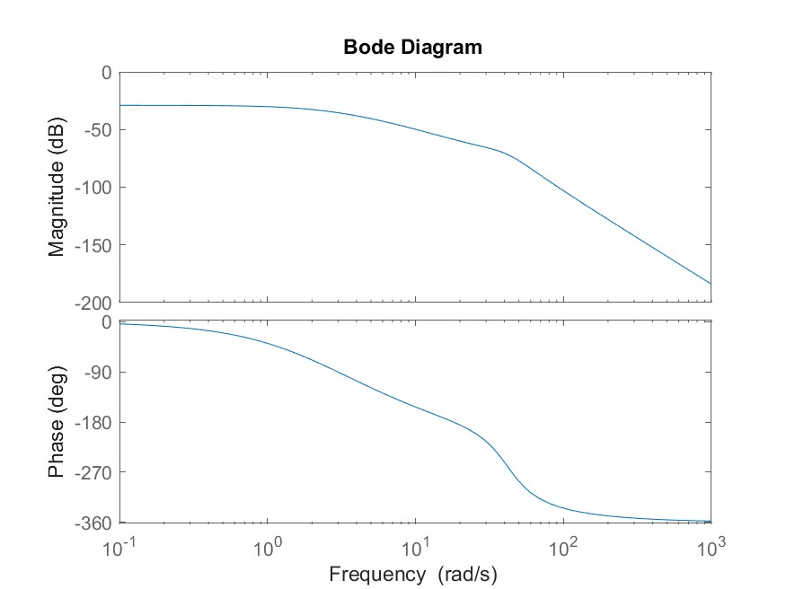
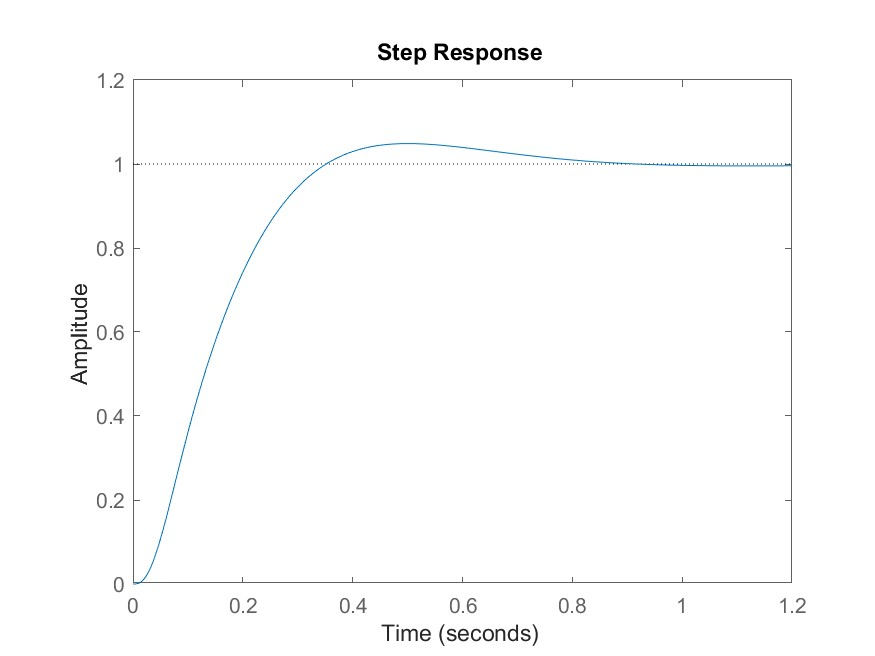

# Open-loop step response

Q1: `DCMotor.slx`

Q2: `1-open.jpg`

> 

Q3: `2-bode.jpg`

> 

Q4(a): Steady state speed $= 0.05$

Q4(b): Rise time $= 1.2309$ s

Q4(c): Settling time $= 2.2083$ s

# Analog filter design

## Low pass filter

Q5: `3-lowpass.jpg`

> 

Q6: `4-lowpass-30.jpg`

> 

Q7: Yes

Q8: Gain margin $= 58.1$ dB

Q9: Phase cross-over frequency $= 19$ rad/s

## Butterworth filter

Q10: $N_{Bw} = 2$

Q11: $s = -35.3553 ±35.3553i$

Q12: `5-butterworth-bode.jpg`

> 

Q13: Yes

Q14: Gain margin $= 54$ dB

Q15: Phase cross-over frequency $= 15.3$ rad/s

Q16: $N_{Bw} = 4$

## Chebyshev Type 1 filter

Q17: $N_{Cb1} = 2$

Q18: $s = -16.1225 ±38.8579i$

Q19: `6-chebyshev-bode.jpg`

> 

Q20: Yes

Q21: Gain margin $= 58.5$ dB

Q22: Phase cross-over frequency $= 18$ rad/s

Q23: $N_{Cb1} = 2$

## Closed-loop control

Q24: `7-pid-step.jpg`

> 

Q25: Yes

Q26: Yes

Q27: Yes